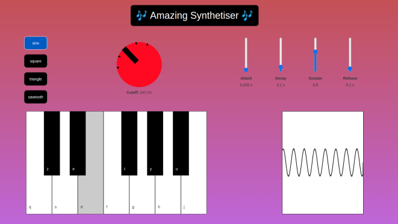

# react-synth

A fun synthetiser made using React + Web Audi API.

Features implemented : 
* waveform selection, 
* low pass filter
* volume enveloppe
* volume visualisation

User can play a note by pressing the corresponding key on your computer keyboard or just by clicking the keyboard. 

I used Le Wagon React boilerplate with the following config:

- React, ReactDOM
- Redux, React-Redux
- Webpack 3
- Babel with es2015 and react presets
- Bootstrap (css only, loaded from a cdn in `index.html`)
- work with `.js` or `.jsx` files
- main `application.scss` stylesheet is imported in `index.js` as a module to enjoy hot reloading
